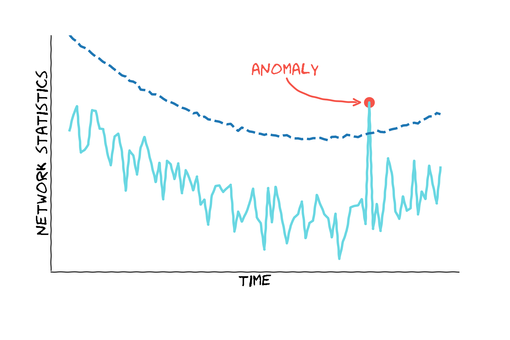
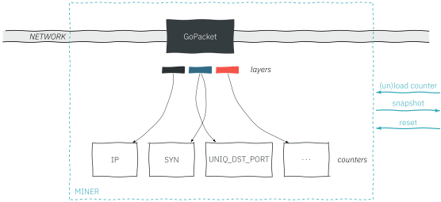

# netspot

<table style="width: 100%; display: block;">
<tr>

</tr>
<tr>
<code>netspot</code> is a simple <it>anomaly-based</it> network IDS written in <code>Go</code> (based on <a href="https://github.com/google/gopacket"><code>GoPacket</code></a>).

The <code>netspot</code> core uses <a href="https://asiffer.github.io/libspot/"><code>SPOT</code></a>, a statistical learning algorithm so as to detect abnormal behaviour in network traffic. 

<code>netspot</code> works as a server and can be controlled trough an HTTP REST API (a <code>Go</code> RPC endpoint is also available).
The current package embeds a client: <code>netspotctl</code> but the latter could be in a different package in the future.
</tr>
</table>

<!-- <div style="width: 100%; display: block">-</div> -->

## Table of contents
- [The SPOT algorithm through a single picture](#the-spot-algorithm-through-a-single-picture)
- [Installation](#installation)
	- [From sources](#from-sources)
    - [Debian package](#debian-package)
    - [Docker container](#docker-container)
- [Get started](#get-started)
- [REST API](#rest-api)
- [Architecture overview](#architecture-overview)
    - [Miner](#miner)
    - [Analyzer](#analyzer)
    - [Alarms](#alarms)
- [Notes](#notes)


## The SPOT algorithm through a single picture

As *a good sketch is better than a long speech*, we illustrate what the [`SPOT`](https://asiffer.github.io/libspot/) algorithm does below.

<center></center>

## Installation

### From sources

You naturally have to clone the git repository and build the executables. The building process requires the `Go` compiler (I use the version `1.10.4` on linux/amd64 and `1.12.9` on linux/arm)
and some dependencies that you can get with `make deps`.

```console
$ git clone github.com/asiffer/netspot.git
$ cd netspot
$ make deps
$ make
$ sudo make install
```
The installation step put the two executables in `$(DESTDIR)/usr/bin`, the configuration file in `$(DESTDIR)/etc/netspot` and the `systemd` service file in `$(DESTDIR)/lib/systemd/system`. By default `$(DESTDIR)` is empty.

### Debian package

A debian package is also available on the release section. Two architectures are available `amd64` and `armhf` (for a Raspberry Pi for instance).

### Docker container

A `docker` image (based on `alpine`) also exists. Some options can naturally be added to start a new container.

```console
$ docker run --rm --name=netspot \
             --net=host \
             -p 11000:11000 \
             -p 11001:11001 \
             -v netspot.toml:/etc/netspot/netspot.toml \
                asiffer/netspot-amd64:1.3
```


## Get started

### Starting the server

Basically, you can start the server by executing the binary.
```console
$ netspot
```

Naturally, some options are loaded by default. `netspot` reads first the `/etc/netspot/netspot.toml` config file. 
So you can have some errors (like the the device to sniff) but this is not problem since it can be changed afterwards.

If you want to change some options while starting, some of them can be overriden by command-line parameters.
```console
netspot --device eth0 --output-dir /tmp
```
In this case, `netspot` reads  `/etc/netspot/netspot.toml` and then it changes the sniffed device and the directory where the results will be stored.
Otherwise these options can be set directly in the config file (you can also use another config file with the `-c` flag).

### Endpoints

By default, `netspot` exposes two endpoints:
- **HTTP** (`127.0.0.1:11000`)
- **Go RPC** (`127.0.0.1:11001`)

While the HTTP API is rather general, the RPC endpoint is likely to be useful only for Go clients (like the built-in client: `netspotctl`).

You can modify or desactivate the endpoints through CLI flags.
```console
$ netspot --no-rpc --http 127.0.0.1:15000
```

### HTTPS

TLS can be set up on the HTTP endpoint. For this purpose, you need to provide a certificate and a key. You can create a RSA key and a self-signed certificate with `openssl` for instance:

```console
$ openssl req -newkey rsa:4096 -nodes -keyout key.pem -x509 -out cert.pem
```

Then the HTTPS configuration can be set-up either in the config file or in the cli flags.
```console
$ netspot --tls --cert cert.pem --key key.pem  
```

### Configuring the server with `netspotctl`

The `netspot` server can be managed by the `Go` built-in client `netspotctl`. When the server is up, you can easily run the client.

```console
$ netspotctl
Connected to netspot server (localhost:11001)
netspot >
```

Now you can run some commands. In particular we can access the configuration of the server:

```console
netspot > config
Miner
     snapshot_length   65535
         promiscuous   true
             timeout   20s
              device   lo

Analyzer
          statistics   [PERF R_SYN R_ACK]
              period   1s
            influxdb   false
                file   true
              output   /tmp
```

We can see several things. First the configuration is divided into two categories: `Miner`, which deals with the network capture and `Analyzer` which manages the statistics and the outputs.

#### Miner

In the above example, we see that the server is ready to sniff the `lo` device (loopback) in promiscuous mode (the snapshot length if the maximum size to read for each packet and the timeout is roughly the maximum delay between two received packets, see the [libpcap documentation](https://www.tcpdump.org/manpages/pcap.3pcap.html) for more details).

These configurations can be changed with the `set` command
```console
netspot > set device enp2s0
```

The device can also be a capture file, thus we can indicate the [absolute path] of the file we want to analyze.

```console
netspot > set device /data/pcap/capture.pcap
```

#### Analyzer

The analyzer defines what is monitored. So we can choose the statistics to look at (`load` and `unload` commands) and also at which interval they are computed (`period`). As we have seen above, the `config` command gives the current status of the server (the statistics already loaded and the period).

To load a new statistic
```console
netspot > load R_IP
```

To unload a statistic
```console
netspot > unload R_SYN
```

To change the period
```console
netspot > set period 500ms
```

Moreover we can tune the outputs of the server. Basically, `netspot` creates 3 files:
- The raw statistics (computed every `period`)
- The SPOT thresholds which are automatically computed
- The anomalies (when a stat is higher or lower than the SPOT threshold)

These files are located is a user-defined directory (`/tmp` by default)
`netspot` embeds a `influxdb` client 

## REST API

The current implementation of `netspot` embeds a `Go` client. However, `netspot` can be managed by other clients since it exposes a REST API.

The description of the API respects the [OpenAPI](https://swagger.io/specification/) standard and can be found [here](api/openapi.yaml). 
The endpoints are detailed in the [api](api/) folder.

## Architecture overview

<center></center>


At the lowest level, `netspot` parse packets and increment some basic **counters**. This part is performed by the `miner` subpackage.
The source can either be an network interface or a .pcap file (network capture).

At a given frequency, counter values are retrieved so as to build **statistics**, this is the role of the `analyzer`. The statistics are the measures monitored by `netspot`.

Every statistic embeds an instance of the `SPOT` algorithm to monitor itself. This algorithm learns the *normal* behaviour of the statistic and constantly updates its knowledge. When an abnormal value occurs, `SPOT` triggers an alarm.

A logging system stores the stat values and the corresponding thresholds either to files or to an [influxdb](https://www.influxdata.com/) instance.

### Miner

The goal of the `miner` is threefold:
* parse incoming packets
* dispatch layers to the concerned counters
* send snapshots along time (at the desired frequency)

<!--  -->
<center></center>

The dispatching is done concurrently to increase performances. However when a snapshot has to be done, packets parsing is paused and we wait for all the counters to finish to process the last layers they receive. It seems like it's long, but actually it's quite fast.

Many counters are already implemented within `netspot` like
* number of SYN packets;
* number of ICMP packets;
* number of IP packets;
* number of unique source IP addresses...

but `netspot` is designed to be modular, so every user is free to developed its own counter insofar as it respects the basic counter layout.


### Analyzer

Above the counters we can build network statistics on fixed-time intervals \(t\). For instance with the counters #SYN and #IP, the ratio of SYN packets can be computed: R_SYN = #SYN/#IP.

Every statistic embeds a `SPOT` instance to monitor itself. Like the counters, you can define all the desired statistics in so far as the required counters are implemented.

### Alarms

When a `SPOT` instance finds an abnormal value, it merely logs it (currently to a file or to InfluxDB).


## Notes

### Version 1.3

The IDS is quite ready for a release!
* New counters and new stats
* New HTTP API with OpenAPI spec
* Cleaner code
* New distributions options (Debian package, Docker image, `armhf` binaries)


### Version 1.2

Bye, bye Python... Welcome Go! The IDS has been reimplemented in `Go` for performances and concurrency reasons.

A controller (CLI) is also provided so as to manage the NetSpot service. I don't know if I will put it in another package later.

More tests are always needed.

### Version 1.1

This version is cleaner than the previous one. Some object have been added so as to balance the tasks. The interactive console is also simpler.

Now, I am reflecting on improving performances. Python is not very efficient for this purpose so I will probably use another programming language for specific and highly parallelizable tasks.

Sorry Scapy, but you take too long time to parse and dispatch packets...


### Version 1.0

This first version is ugly: everything is a big class! No, not really but the size of the main object has increased greatly with the new incoming ideas. So the next version will try to split it into smaller classes.

Moreover, there are not any unit tests (see cfy for good arguments), but the next version will be more serious (I hope).

There are probably many bugs, don't be surprised.
