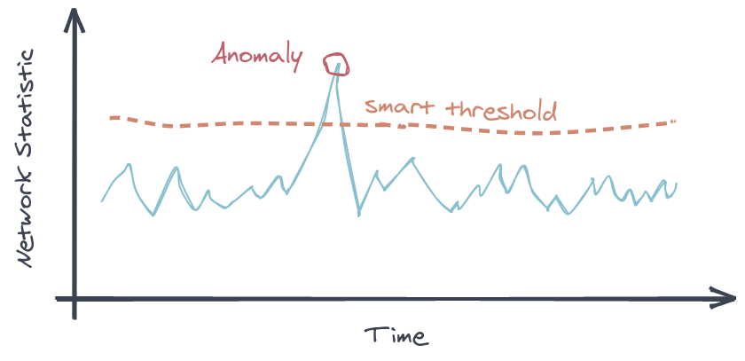
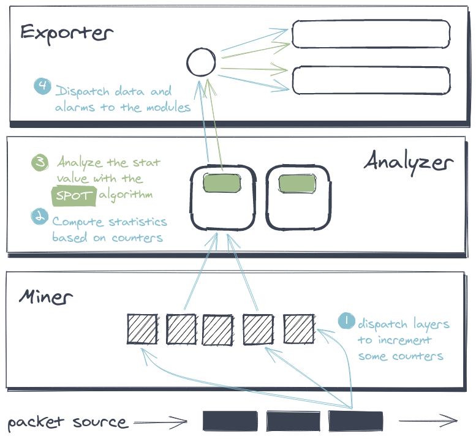

# netspot

A simple IDS with statistical learning


## Overview

**netspot** is a simple anomaly-based network IDS written in `Go` (based on [GoPacket](https://github.com/google/gopacket))

The **netspot** core uses [**SPOT**](https://asiffer.github.io/libspot/), a statistical learning algorithm so as to detect abnormal behaviour in network traffic.



**netspot** is provided as a single and statically-compiled binary ([musl](https://www.musl-libc.org/) + [libpcap](https://www.tcpdump.org/)).


## Installation

### Binaries

The latest compiled binaries can be found on the released tag. 

### Building from sources


To build **netspot** from sources, you mainly need a `Go` compiler and `libpcap-dev`.

```sh
git clone -b v2.0 https://github.com/asiffer/netspot.git
cd netspot
make
```

## Get started

Basically, you can run `netspot` on a network interface. In the example below,
`netspot` monitors the `PERF` statistics (packet processing rate) on the `eth0` interface. 
The computation period is `1s` and the values are printed to the console (`-v`).

```sh
netspot run -d eth0 -s PERF -p 1s -v
```

You can also analyze a capture file.
```sh
netspot run -d file.pcap -s PERF -s R_SYN -p 500ms -v
```

All these command-line options can be set in a config file:
```toml
# netspot.toml

[miner]
device = "~/file.pcap"

[analyzer]
period = "500ms"
stats = ["PERF", "R_SYN"]

[exporter.console]
data = true
```

```sh
netspot run --config netspot.toml
```


All the available statistics can be listed with the `netspot  ls` command.


To print the default config (in TOML format only), you can run the following command:
```sh
netspot defaults
```

### Netspot As A Service

Even if it is not the main way to use **netspot**, it can 
run as a service, exposing a minimal REST API.

```sh
netspot serve
```

By default it listens at `tcp://localhost:11000` but it can be changed with the `-e` flag.

```sh
netspot serve -e unix:///tmp/netspot.sock
```

| Method | Path           | Description |
|--------|----------------|-------------|
| `GET`  | `/api/config`  | Get the current config (JSON output) |
| `POST` | `/api/config`  | Change the config (JSON expected) |
| `POST`  | `/api/run`  | Manage the status of netspot (start/stop) |


## Architecture overview




At the lowest level, `netspot` parse packets and increment some basic **counters**. This part is performed by the `miner` subpackage.
The source can either be an network interface or a .pcap file (network capture).

At a given frequency, counter values are retrieved so as to build **statistics**, this is the role of the `analyzer`. The statistics are the measures monitored by `netspot`.

Every statistic embeds an instance of the `SPOT` algorithm to monitor itself. This algorithm learns the *normal* behaviour of the statistic and constantly updates its knowledge. When an abnormal value occurs, `SPOT` triggers an alarm.

The analyzer forwards statistics values, SPOT thresholds and SPOT alarms to the `exporter`. This last component dispatch
these information modules that binds to different backends 
(console, file, socket or InfluxDB database).


## What's next?

I am currently splitting the analyzer, extracting a kind of "exporter" module to manage i/o (data, thresholds and alarms)

Moreover, I think that I will also separate the client. 
About the API, I am definitely looking at `gRPC` to both
control the server and also receive data.

## Notes

### Version 2.0a
This is the second big refactoring. Many things have changed, making the way to use **netspot** more *modern*.

- Single and statically-compiled binary. Forget about the server, just run the binary on what you want (a server mode still exists but it is rather minimal)
- Better performances! I think that **netspot** can process 
twice as fast: **1M pkt/s** on my affordable desktop and **100K pkt/s** on a Raspberry 3B+. 
- Developper process has been improved so as to "easily" add new counters, statistics and exporting modules.

### Version 1.3

The IDS is quite ready for a release!
* New counters and new stats
* New HTTP API with OpenAPI spec
* Cleaner code
* New distributions options (Debian package, Docker image, `armhf` and `aarch64` binaries)


### Version 1.2

Bye, bye Python... Welcome Go! The IDS has been reimplemented in `Go` for performances and concurrency reasons.

A controller (CLI) is also provided so as to manage the NetSpot service. I don't know if I will put it in another package later.

More tests are always needed.

### Version 1.1

This version is cleaner than the previous one. Some object have been added so as to balance the tasks. The interactive console is also simpler.

Now, I am reflecting on improving performances. Python is not very efficient for this purpose so I will probably use another programming language for specific and highly parallelizable tasks.

Sorry Scapy, but you take too long time to parse and dispatch packets...


### Version 1.0

This first version is ugly: everything is a big class! No, not really but the size of the main object has increased greatly with the new incoming ideas. So the next version will try to split it into smaller classes.

Moreover, there are not any unit tests (see cfy for good arguments), but the next version will be more serious (I hope).

There are probably many bugs, don't be surprised.
