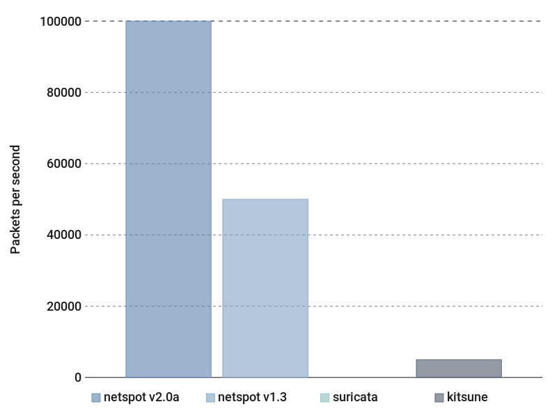
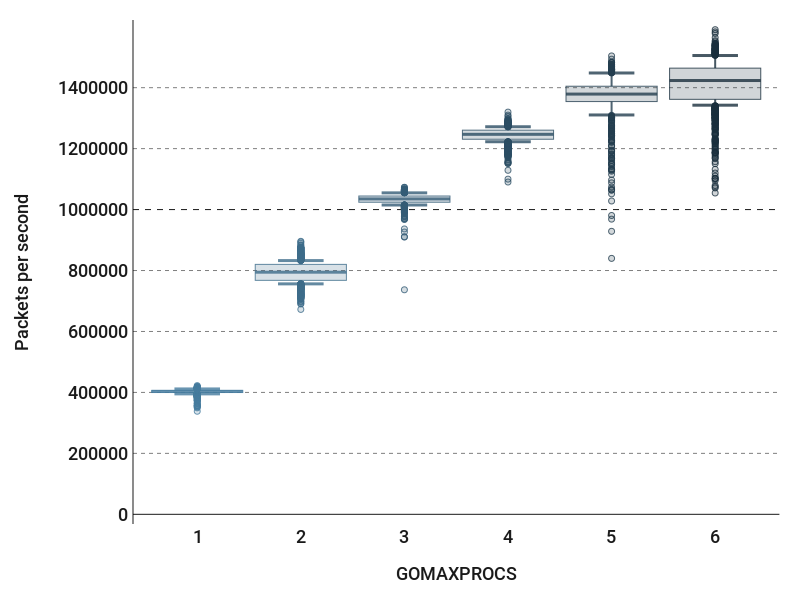

Performance is a key feature for network intrusion detection systems. The simplicity of `netspot` actually makes it **fast**.

## Comparison with other IDS

If we compare `netspot` with [`Suricata`](https://suricata-ids.org/) (common rule-based IDS) and [Kitsune](https://arxiv.org/pdf/1802.09089) (trendy anomaly-based IDS in the research area), we merely notice
that `netspot` is far faster.

The performances of Kitsune come from their original paper while some experiments have been performed on a [capture file](https://drive.google.com/file/d/1fERsIA4uW9Qa1ej-L_3bWqjbRf7UK2wS/view?usp=sharing) (provided by the authors of Kitsune) for `Suricata` and `netspot`.

### Desktop

<!-- 
 -->

<!-- <object type="image/svg+xml" data="img/perf-desktop.svg"></object> -->

<object data="img/perf-desktop.svg" type="image/svg+xml" style="width: 100%;"></object>

<!-- 
 -->
<!--  -->

### Raspberry Pi 3B+

<!-- prettier-ignore -->
!!! warning
    Suricata was not available on ARM platform during our tests

<!-- 

<object type="image/svg+xml" data="/assets/perf-rpi.svg"></object>

 -->

<object type="image/svg+xml" data="img/perf-rpi.svg"></object>

<!--  -->

## Number of processors

`netspot` tremendously uses goroutines. It brings much performance if your computer has several cores, so we may wonder the impact of the number of processors. For that, we show some runs we made on a desktop computer with 6 Intel(R) Core(TM) i5-8400 CPU @ 2.80GHz.

The next results come from the analysis of a pcap file
available on [MAWILAB](http://mawi.wide.ad.jp/mawi/samplepoint-F/2020/202008231400.pcap.gz) that basically stores 74M of packets.

The graph below shows that even if you have few cores (or you want to limit their use), `netspot` remains efficient.

<object type="image/svg+xml" data="img/perf-procs.svg"></object>

<!--  -->

<!-- 

<object type="image/svg+xml" data="/assets/perf-procs.svg"></object>

 -->
